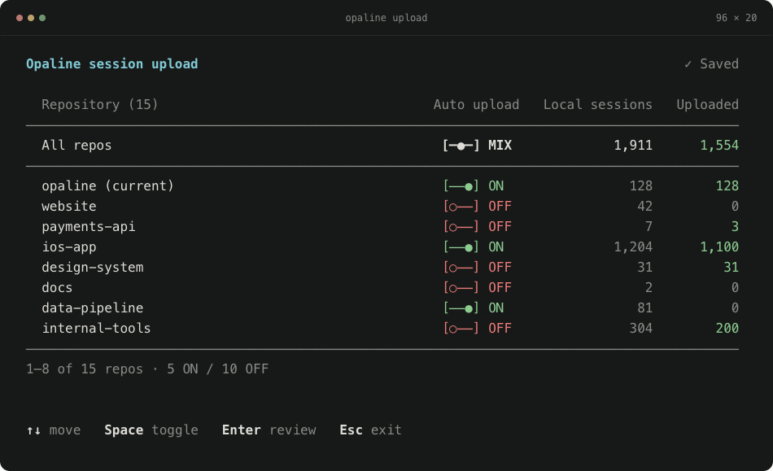

<h1 align="center">Opaline CLI</h1>

<p align="center"><strong>Pull back the curtain on your team's coding sessions.</strong></p>

<p align="center">
  Analytics for your team's Claude Code and Codex sessions.<br>
  Understand what happened, how agents worked, and where the effort went.
</p>

<p align="center">
  <a href="https://www.npmjs.com/package/opaline"></a>
  <a href="https://www.producthunt.com/products/rudel/launches/claude-code-codex-usage-trading-cards-by-rudel" title="Rudel trading cards launch — May 4, 2026"></a>
  <a href="LICENSE"></a>
</p>

<p align="center">
  <a href="https://opaline.so">Open Opaline</a> ·
  <a href="#see-opaline-in-action">The product</a> ·
  <a href="#get-started">Get started</a> ·
  <a href="docs/usage.md">CLI guide</a>
</p>

## See Opaline in action

Opaline brings your team's coding sessions into a shared workspace. Browse sessions across repositories, follow conversations and tool calls, and see model usage, tokens, and API costs in context.

https://github.com/user-attachments/assets/0df4c0b9-bb41-44af-b104-050aa9ae0756

This repository contains the **open-source CLI** that connects your local sessions to [the Opaline app](https://opaline.so).

<p align="center">
  
  <br><sub>Choose which repositories sync with Opaline. Sample data shown.</sub>
</p>

## Get started

Requires **Node.js 20 or newer**. Run from any directory; no global installation needed.

```bash
npx opaline@latest
```

1. **Choose repositories.** Opaline finds local Claude Code and Codex sessions. Use ↑↓ to move and Space to toggle a repository.
2. **Review and confirm.** Press Enter to review, then Enter to confirm. Sign in through your browser when prompted and choose a workspace if needed.
3. **Continue in Opaline.** Existing sessions upload, and future sessions sync automatically. New users finish setup in the browser; returning users open their workspace's Sessions page.

Already started in the browser? Run the command Opaline gives you, including its `--code` value, and approve sign-in in that same browser. This keeps your terminal connected to your setup page.

## How it works

- **One view across both agents.** The picker groups sessions by repository, including sessions from Git worktrees, and shows local and uploaded counts.
- **Automatic uploads for your selections.** Opaline sets up Claude Code and Codex hooks for enabled repositories. Sessions already uploaded to the destination are skipped.
- **Change your mind anytime.** Run the command again to turn repositories ON or OFF. OFF stops future uploads; it does not delete sessions already uploaded. An upload already running may finish.

Type to filter the list. Press Esc to go back from review or leave the picker without saving.

## Data and privacy

**Opaline uploads full session transcripts**, including prompts, responses, source code, tool output, and related metadata. Only enable repositories whose session data you are allowed to share with Opaline.

Known secret patterns are filtered before upload, but **filtering cannot guarantee that every secret is removed**. Keep sensitive data out of agent sessions.

The CLI also sends limited usage analytics, including version, operating system, setup results, and repository/session counts. These events exclude transcript content, repository names, and local paths. Anonymous activity is linked to your account after sign-in.

See [data handling](docs/data-handling.md) for the full disclosure and persistent opt-out settings.

## Common commands

| Command | What it does |
| --- | --- |
| `npx opaline@latest` | Manage repositories and upload sessions. |
| `npx opaline@latest whoami` | Show your account and upload failures. |
| `npx opaline@latest doctor` | Check authentication, connection, and hooks. |
| `npx opaline@latest update` | Review and update supported persistent installations. |
| `npx opaline@latest --help` | Show available commands and options. |

Prefer a shorter command? [Install globally](docs/usage.md#optional-global-install) to use `opaline` directly.

## Documentation and contributing

- [CLI guide](docs/usage.md) — setup, commands, configuration, troubleshooting, and migration from Rudel.
- [Data handling](docs/data-handling.md) — transcript uploads, secret filtering, and usage analytics.
- [Contributing](CONTRIBUTING.md) — local development and the CLI playground.
- [Report a bug](https://github.com/opalinehq/cli/issues) · [Report a security issue privately](SECURITY.md).
- [Contact](mailto:evren@opaline.so).

Licensed under [MIT](LICENSE).
